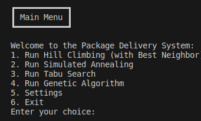
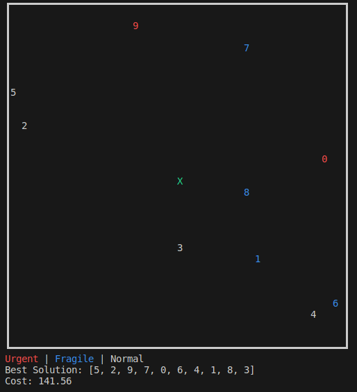

# IA1

## Introduction

This is the first Practical Assignment for the Artificial Intelligence course (IA) 2023/2024 @ FEUP. For this project, we chose the topic **Delivery Scheduling** (3C), an Optimization Problem which description can be found [here](Description.pdf).

Our group is *Group_A1_44*, composed of:
- João Mendes Silva Belchior (up202108777@up.pt)
- José Francisco Reis Pedreiras Neves Veiga (up202108753@up.pt)
- Pedro Vidal Marcelino (up202108754@up.pt)

## Execution

This project was developed using Python and some external libraries like `numpy` and `pandas`. To run the project, you need to have Python installed on your machine. To install the required libraries, you can run the following command:

```bash
pip install numpy pandas
```

Then, just run the main file inside the `src` folder:

```bash
python3 main.py
```

We also used typing hints in our code, and checked the integrity of the code using the library `mypy`. It can be installed with `pip` like the other libraries, and used as follows:

```bash
mypy src/
```

Note that this is not mandatory, but it can help in understanding the code and finding some typing errors.

After, running the main file, the user arrives at the main menu, where he can choose between the following options:



Inside an algorithm/ heuristic menu, the user can choose its parameters:


The list of packages and the best solution found are nicely displayed as follows:



- `X` represents the starting point of the vehicle.
- The numbers represent each package, and its color dependes on the type.

## Problem Definition

This project has as its objective to optimize the delivery of packages from a starting point (0,0) to various destinations, optimizing the travel costs while adhering to each package type's special needs.
It can be succintly described as follows.

### Scenario

There are 3 different types of packages: **fragile**, **normal** and **urgent**.

* **Fragile** packages have a change of getting damaged by kilometer traveled.
* **Urgent** packages have a penalty associated with delays.
* Each kilometer traveled incurs a fixed cost.

### Objective

For an algorithm to be considered successful it needs to:

* **Maintain a high reputation** by keeping packages from breaking and delivering urgent packages on time.
* **Reduce the total cost** which includes penalties from late deliveries, packages broken and distance travalled.


### Constraints

For this project the world will always follow some rules:

* Only one vehicle is available.
* Delivery locations are specified by a pair of coordinates (x,y).
* There are always direct routes between all delivery places.
* The vehicle travels at a constant speed of 60km/hour
* The cost per kilometer is fixed.
* The delivery staff takes 0 seconds to deliver each package.

###  Solution Representation

The solution can be represented as a list of integers representing the indexes of each package on the original list of deliveries.
